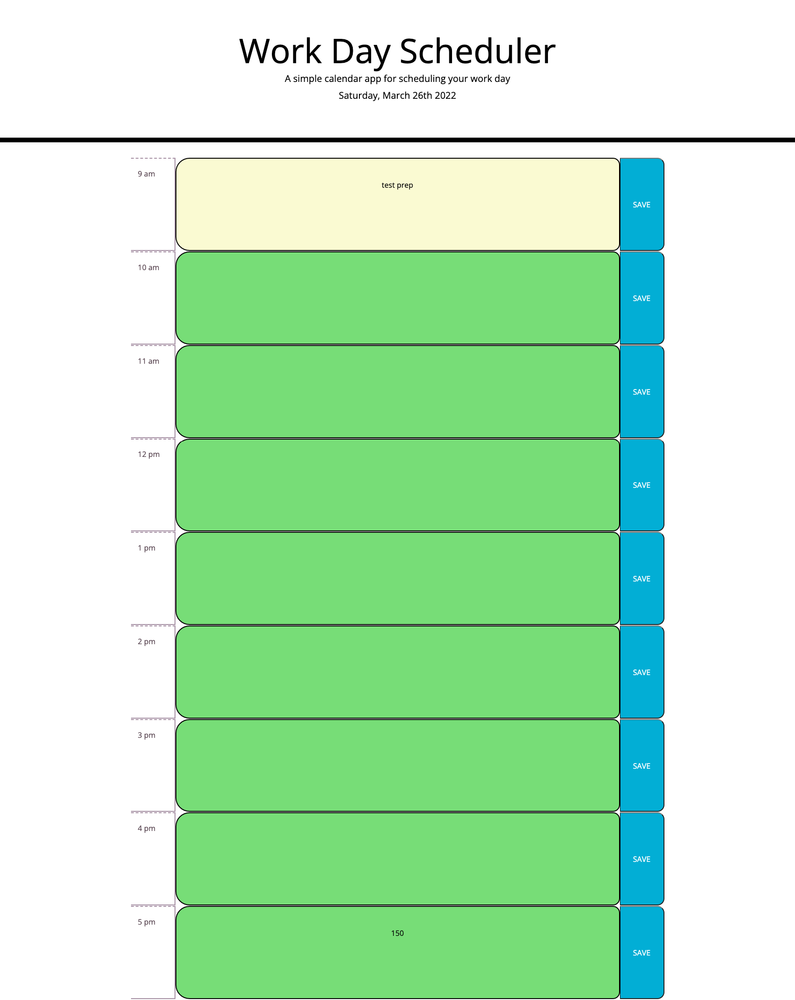

## User Story
As an employee with a busy schedule, I want to add important events to a daily planner, so that I can manage my time effectively.

## Acceptance Criteria
Given I am taking a code quiz
WHEN I click the start button
THEN a timer starts and I am presented with a question
WHEN I answer a question
THEN I am presented with another question
WHEN I answer a question incorrectly
THEN time is subtracted from the clock
WHEN all questions are answered or the timer reaches 0
THEN the game is over
WHEN the game is over
THEN I can save my initials and my score

## LINK TO DEPLOYED APPLICATION
[Deployed Link](https://conneriraola.github.io/day-planner/)

## SCREENSHOT
